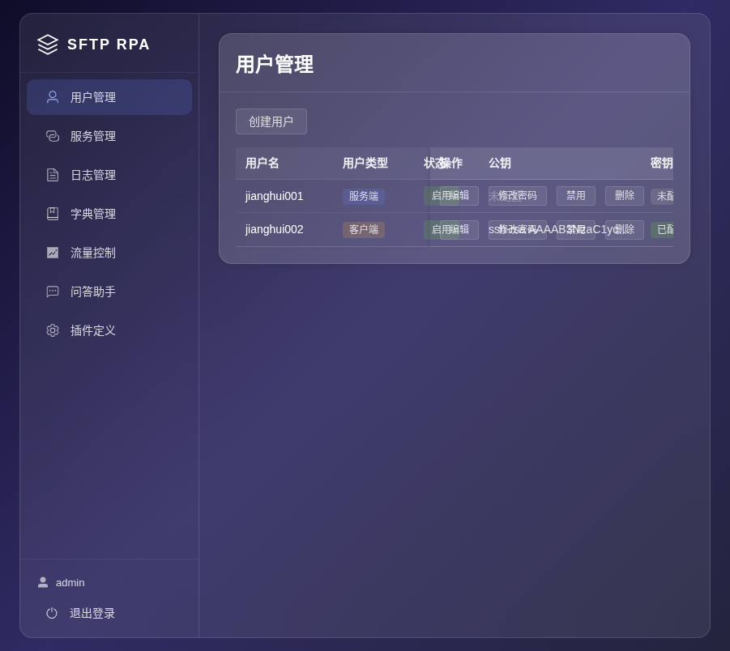
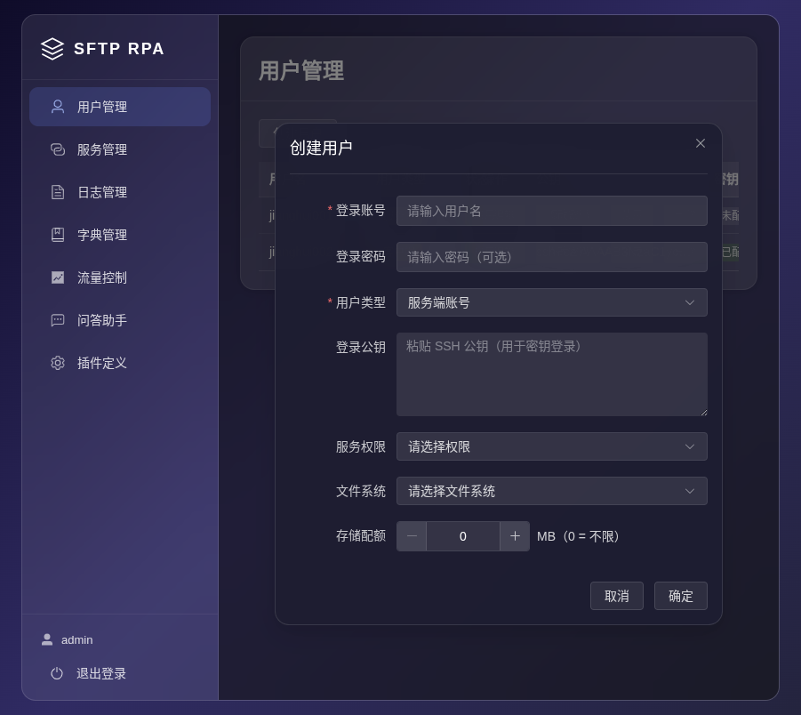
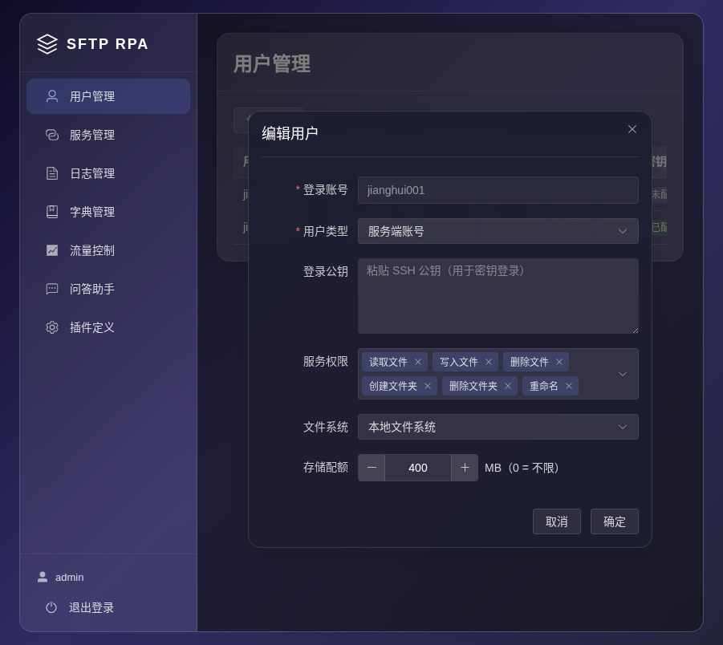
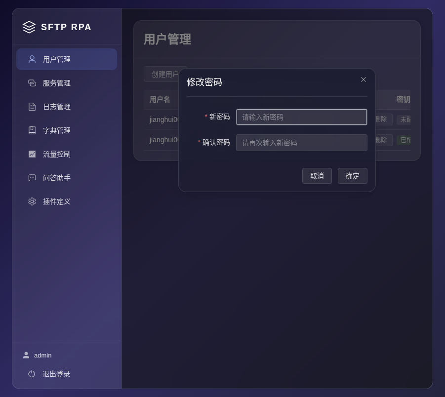

# 用户管理功能培训文档

## 1. 功能概述

用户管理模块用于管理系统中的 SFTP 用户账户，支持以下操作：

- **创建用户**：添加新的 SFTP 用户
- **编辑用户**：修改已有用户的信息
- **修改密码**：独立修改用户登录密码
- **启用/禁用**：切换用户账户状态
- **删除用户**：移除用户账户

用户分为两种类型：**服务端账号** 和 **客户端账号**。下面先理解这两种账号的区别，否则后面的配置无从下手。

---

## 2. 理解用户类型（必读）

本平台是一个 SFTP 文件传输中间件，核心工作就是"转发文件"。**服务端账号** 和 **客户端账号** 分别对应文件传输的两端。

### 2.1 服务端账号 — "别人连我"

**适用场景：** 你的系统需要接收外部合作方上传的文件，或者允许外部用户下载你提供的文件。

**工作方式：**

```
你的服务器（本平台）                 合作方
┌─────────────────┐               ┌────────────┐
│  SFTP 服务端     │ ←── 连接 ─── │ 对方 SFTP   │
│  （本平台监听端口）│               │  客户端     │
└─────────────────┘               └────────────┘
```

- 本平台启动一个 SFTP 服务器，监听在 `7022` 端口
- 合作方使用你创建的 **服务端账号** 连接本平台的 SFTP 服务器
- 合作方可以上传文件到你的服务器，或者从你的服务器下载文件

**类比：** 就像你开了一家快递驿站（SFTP 服务端），别人拿着你给的取件码（账号密码/密钥）来寄件或取件。

### 2.2 客户端账号 — "我连别人"

**适用场景：** 你的系统需要主动去外部服务器拉取文件，或者你需要把文件推送到合作方的 SFTP 服务器。

**工作方式：**

```
你的服务器（本平台）                 合作方
┌─────────────────┐               ┌──────────────┐
│  SFTP 客户端     │ ─── 连接 ──→ │ 对方 SFTP     │
│  （本平台主动发起）│               │  服务端       │
└─────────────────┘               └──────────────┘
```

- 本平台作为 SFTP 客户端，主动去连接合作方提供的 SFTP 服务器
- 合作方需要先在他们那边开通一个 SFTP 账号
- 本平台使用 **客户端账号** 配置的连接信息，主动登录对方的 SFTP 服务器

**类比：** 就像你每天去合作方的仓库（对方的 SFTP 服务端）取货，你需要对方给你一把钥匙（账号密码/密钥）。

### 2.3 一张图看懂

```
┌────────────────────────────────────────────────────────────┐
│                    本平台 (SFTP RPA)                        │
│                                                            │
│  ┌──────────────────────┐    ┌──────────────────────┐      │
│  │   服务端账号           │    │   客户端账号           │      │
│  │   （别人连接我）       │    │   （我连接别人）       │      │
│  │                       │    │                       │      │
│  │  本机:7022 监听       │    │  主动连接远程服务器    │      │
│  │  别人上传/下载文件     │    │  拉取/推送文件         │      │
│  └──────────────────────┘    └──────────────────────┘      │
└────────────────────────────────────────────────────────────┘
```

---

## 3. 用户列表

登录系统后，默认进入用户管理页面，可查看所有用户列表。



列表展示以下信息：

| 列名 | 说明 |
|------|------|
| 用户名 | 用户登录标识 |
| 用户类型 | **服务端**：别人用此账号连接本平台；**客户端**：本平台用此账号连接别人 |
| 状态 | 启用 / 禁用。禁用后账号无法使用 |
| 公钥 | SSH 公钥内容（鼠标悬停查看完整值） |
| 密钥 | 密钥配置状态（已配置 / 未配置） |

**操作按钮：**

- **编辑**：修改用户基本信息
- **修改密码**：独立修改用户登录密码
- **启用/禁用**：切换账户的可用状态
- **删除**：移除该用户

---

## 4. 创建用户

点击页面左上角的 **"创建用户"** 按钮，弹出创建用户对话框。



### 4.1 通用字段

| 字段 | 必填 | 说明 |
|------|------|------|
| 登录账号 | 是 | 用户唯一标识，创建后不可修改 |
| 登录密码 | 否 | SFTP 登录密码。可不设置，后续通过"修改密码"功能配置 |
| 用户类型 | 是 | **服务端账号** 或 **客户端账号**，选错会导致无法正常传输文件 |
| 登录公钥 | 否 | SSH 公钥。用于密钥认证，比密码更安全 |

### 4.2 密码认证 vs 密钥认证

本平台支持两种 SFTP 身份认证方式：

| 方式 | 说明 | 适用场景 |
|------|------|---------|
| **密码认证** | 输入用户名 + 密码即可连接 SFTP | 简单场景，适合测试或低安全要求环境 |
| **密钥认证** | 使用 SSH 密钥对（私钥 + 公钥）认证 | 生产环境推荐，更安全 |

**两种方式可以同时存在**，SFTP 客户端连接时会先尝试密钥认证，失败后再尝试密码认证。

### 4.3 SSH 密钥对的流转方式 — 细看

密钥认证涉及一对文件：**私钥**（自己保留，绝不能泄露）和 **公钥**（可以公开，配置到服务器上）。

**场景一：服务端账号 — 别人用密钥连接本平台**

```
合作方电脑                         本平台
┌──────────┐                    ┌──────────────┐
│ 生成密钥对  │                    │              │
│  ├ 私钥（自留）│                    │  创建服务端账号  │
│  └ 公钥 →──┼── 提供给平台运维 ──→ │  ├ 填入公钥     │
│           │                    │  └ 保存        │
└──────────┘                    └──────────────┘

连接时：
合作方使用私钥 → 连接本平台 SFTP → 平台用公钥验证 → 认证通过
```

操作步骤：
1. 合作方在自己电脑上生成 SSH 密钥对（命令：`ssh-keygen -t rsa`）
2. 合作方将 **公钥文件（~/.ssh/id_rsa.pub）的内容** 提供给平台运维人员
3. 运维人员在本平台创建 **服务端账号**，将公钥粘贴到"登录公钥"字段
4. 合作方使用 **私钥** 连接本平台的 SFTP 服务器（端口 7022）
5. 平台用存储的公钥验证对方身份，认证通过

**场景二：客户端账号 — 本平台用密钥连接别人的服务器**

```
本平台                          对方 SFTP 服务器
┌──────────────┐                    ┌──────────────┐
│ 创建客户端账号  │                    │              │
│ 点击"生成公钥" │                    │  对方运维操作：  │
│  ├ 私钥（系统保存）│                    │  将公钥添加到   │
│  └ 公钥 →──┼── 提供给对方运维 ──→ │  SFTP 授权列表  │
└──────────────┘                    └──────────────┘

连接时：
本平台使用保存的私钥 → 连接对方 SFTP → 对方用公钥验证 → 认证通过
```

操作步骤：
1. 在本平台创建 **客户端账号**，选择密钥类型（RSA / ECDSA / ED25519）
2. 点击 **"生成公钥"** 按钮，平台自动生成一对密钥
3. **公钥显示在页面上**，复制公钥内容
4. 将公钥提供给对方 SFTP 服务器的管理员
5. 对方管理员将公钥添加到他们的 SFTP 授权列表中
6. 配置完成后，本平台即可使用保存的 **私钥** 主动连接对方的 SFTP 服务器
7. 整个过程 **私钥不会离开本平台**，保证安全

### 4.4 服务端账号专属字段

选择 **"服务端账号"** 时，额外显示以下字段：

**服务权限** — 控制此账号在 SFTP 服务器上能做什么：

| 权限 | 说明 |
|------|------|
| 读取文件 | 允许下载、查看文件内容 |
| 写入文件 | 允许上传、覆盖文件 |
| 删除文件 | 允许删除已存在的文件 |
| 创建文件夹 | 允许新建目录 |
| 删除文件夹 | 允许删除目录 |
| 重命名 | 允许修改文件或文件夹名称 |

> 例如：只允许合作方上传文件，不允许读取或删除，那么只勾选"写入文件"即可。

**文件系统** — 文件实际存储在哪里：

| 类型 | 说明 | 适用场景 |
|------|------|---------|
| 本地文件系统 | 文件直接存储在本机磁盘上 | 大多数场景 |
| SFTP 文件系统 | 本机作为中转，文件实际存储在另一台 SFTP 服务器 | 已有单独的文件服务器 |
| S3 文件系统 | 对接 S3 兼容的对象存储（MinIO / AWS S3） | 使用对象存储的场景 |

### 4.5 客户端账号专属字段

选择 **"客户端账号"** 时，额外显示以下字段：

| 字段 | 说明 |
|------|------|
| 远程 IP | 对方 SFTP 服务器的 IP 地址或域名 |
| 远程端口 | 对方 SFTP 服务器的端口，默认 22 |
| 主机密钥算法 | 对方服务器的主机密钥算法，一般选 `ssh-rsa` |
| 公钥认证算法 | 连接时使用的公钥算法，一般选 `ssh-rsa` |

> 这些信息由对方 SFTP 管理员提供。如果不确定算法选哪个，与对方确认后再配置。

---

## 5. 编辑用户

点击用户列表中的 **"编辑"** 按钮，弹出编辑用户对话框。



编辑界面与创建界面一致，区别如下：

- **登录账号**：不可修改（创建后固定）
- **登录密码**：编辑界面不包含密码字段，密码需通过"修改密码"功能单独管理
- 其他字段均可修改

---

## 6. 修改密码

密码作为独立功能维护，不包含在编辑表单中。点击 **"修改密码"** 按钮，弹出修改密码对话框。



> **密码的用途：** 无论是服务端账号还是客户端账号，密码都用于 SFTP 协议的身份认证。服务端账号的密码用于别人登录本平台时验证身份；客户端账号的密码用于本平台登录对方服务器时使用。

输入新密码并确认后提交，系统会对密码进行加密存储。

---

## 7. 启用/禁用用户

点击 **"启用"** 或 **"禁用"** 按钮，可切换用户账户状态：

- **启用**：用户可以正常登录使用
- **禁用**：用户无法登录系统

此操作无需确认，点击后立即生效。

---

## 8. 删除用户

点击 **"删除"** 按钮，系统弹出确认对话框：

- 确认删除后，用户账户将被永久移除
- 删除操作不可恢复

---

## 9. 完整业务流程示例

### 场景一：合作方上传文件到本平台

**业务需求：** 外部合作方需要每天上传数据文件到本平台，由系统自动处理。

**配置步骤：**

1. 点击 **"创建用户"**
2. 填写 **登录账号**（如 `partner_a`）
3. 设置 **登录密码**（后续也可以通过密钥认证）
4. **用户类型** 选择 **"服务端账号"**
5. 如果合作方提供了 SSH 公钥，粘贴到 **"登录公钥"** 字段
6. **服务权限**：只勾选 **"写入文件"**（只允许上传，不允许读取和删除）
7. **文件系统**：选择 **"本地文件系统"**
8. 点击 **确定** 创建用户

**合作方操作：**
1. 使用 SFTP 客户端（如 FileZilla、WinSCP）连接本平台 IP，端口 7022
2. 使用创建的用户名和密码（或密钥）登录
3. 上传数据文件

### 场景二：本平台定时从外部拉取文件

**业务需求：** 本平台需要每天凌晨从合作方的 SFTP 服务器下载对账单文件。

**配置步骤：**

1. 联系合作方，获取对方的 SFTP 服务器信息：IP、端口、登录账号
2. 确认对方 SFTP 服务器支持的公钥算法
3. 点击 **"创建用户"**
4. 填写 **登录账号**（对应合作方提供的账号）
5. **用户类型** 选择 **"客户端账号"**
6. 填入 **远程 IP** 和 **远程端口**
7. 选择 **主机密钥算法** 和 **公钥认证算法**（与对方确认）
8. 点击 **"生成公钥"**，复制生成的公钥
9. 将公钥提供给合作方管理员，让他们添加到 SFTP 授权列表
10. 点击 **确定** 创建用户

---

## 10. 常见问题

**Q: 创建用户时可以不设置密码吗？**

A: 可以。密码字段为非必填项，用户创建完成后可通过"修改密码"功能单独设置。

**Q: 编辑用户时为什么没有密码字段？**

A: 密码作为独立的安全功能进行维护，编辑用户信息时不包含密码，需通过"修改密码"按钮单独操作。这样可以避免在修改其他信息时误操作密码。

**Q: 服务端账号和客户端账号选错了怎么办？**

A: 可以在编辑页面修改用户类型。但要注意切换类型后，对应的专属字段配置会发生变化，需要重新填写。

**Q: 密钥认证和密码认证可以同时使用吗？**

A: 可以。两种认证方式可以共存。SFTP 客户端连接时会先尝试密钥认证，失败后再尝试密码认证。

**Q: 客户端账号生成的密钥对，私钥在哪里？**

A: 私钥由系统内部安全保存，不会对外暴露。生成的公钥需要你提供给对方的 SFTP 管理员，添加到授权列表中。

**Q: 合作方更换了公钥怎么办？**

A: 在编辑页面中，直接修改"登录公钥"字段的内容为新公钥即可。
